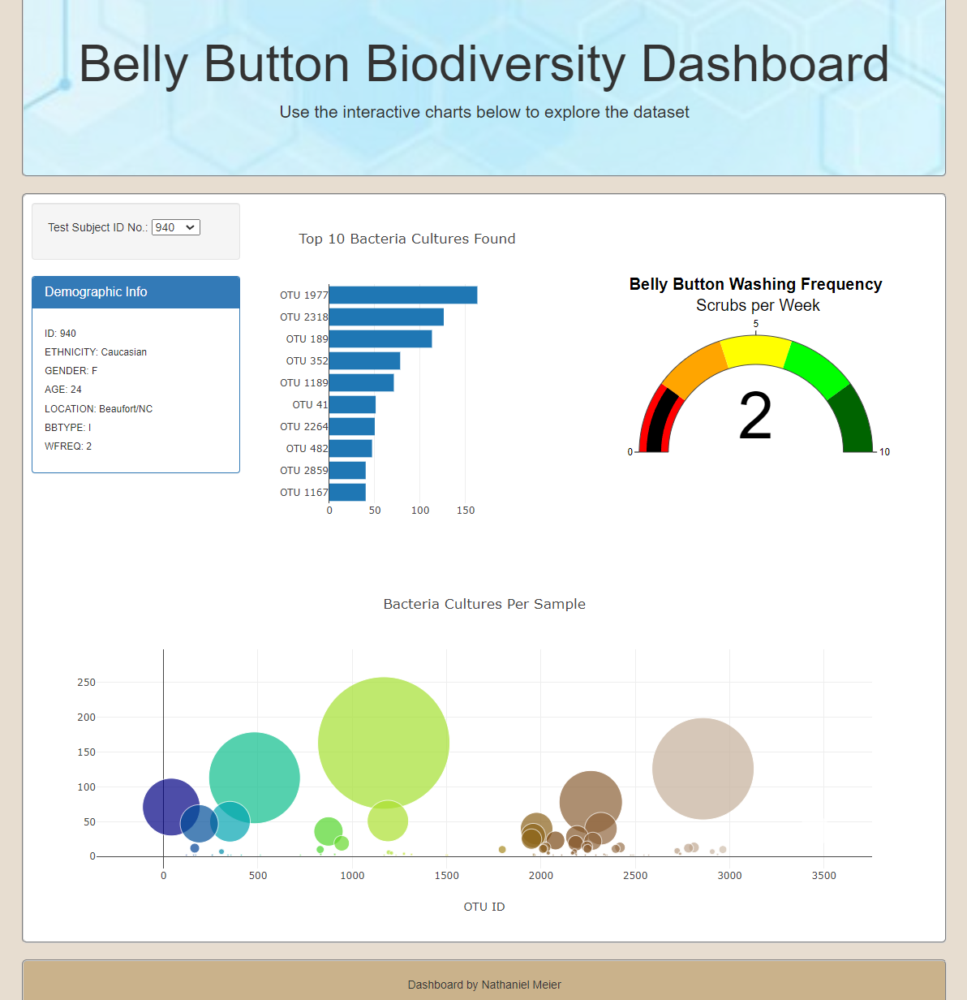

# GitHub.io

## Overview of Project
The client has requested a dashboard of demographic information, graphs, and charts to visualize the bacterial data for each volunteer. Specifically, users should be able to identify the top 10 bacterial species in their belly buttons. This will help users identify whether a species is found in their navel.

## Resources
Data Source: sample.json

Software: HTML, CSS, JavaScript, Bootstrap, Plotly  

## Summary
The webpage has a dropdown of test subject ids to filter the dashboard data. The demographic data is shown. 

The dashboard visuals created:
   * Bar Chart of the top 10 bacteria cultures found.
   * Guage Graphic of the Washing Frequency per week.
   * Bubble Chart of the cultures per sample.

